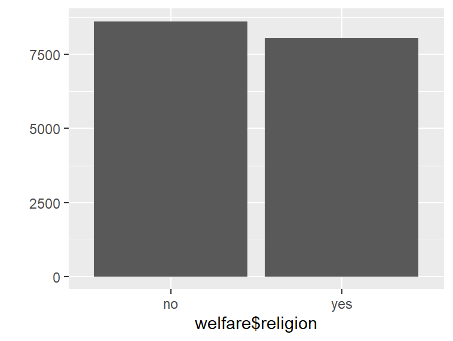
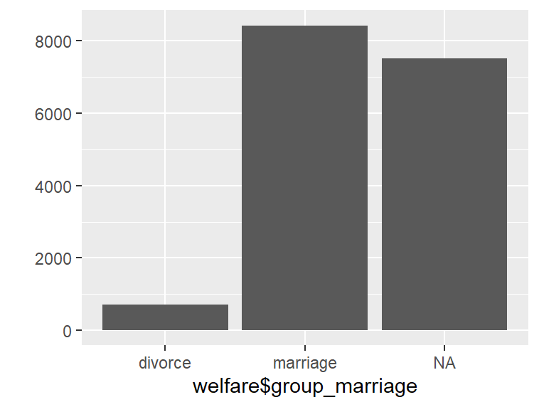
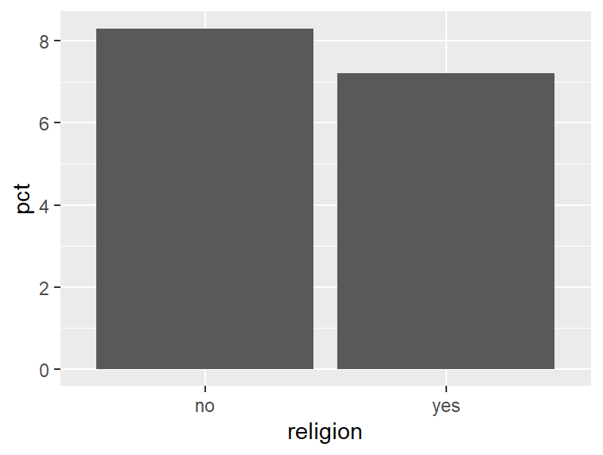
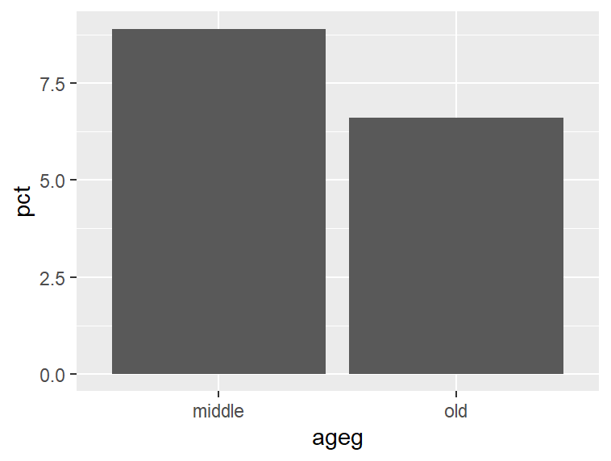
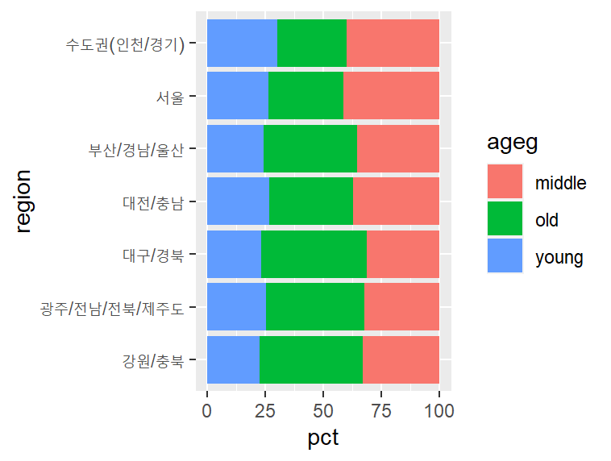

#### 종교 유무에 따른 이혼율

-   종교 변수 검토

```r
class(welfare$religion)
# "numeric"
table(welfare$religion)
#    1    2 
# 8047 8617
```

-   전처리, 종교 유무 이름 부여

```r
welfare$religion <- ifelse(welfare$religion == 1, "yes", "no")

table(welfare$religion)
#   no  yes 
# 8617 8047 

qplot(welfare$religion)
```



-   혼인 상태 변수 검토

```r
class(welfare$marriage)
# "numeric"
table(welfare$marriage)
#    0    1    2    3    4    5    6 
# 2861 8431 2117  712   84 2433   26 
```

-   이혼 여부 변수 만들기

```r
welfare$group_marriage <- ifelse(welfare$marriage == 1, "marriage",
                          ifelse(welfare$marriage == 3, "divorce", NA))

table(welfare$group_marriage)
#  divorce marriage 
#      712     8431 

table(is.na(welfare$group_marriage))
# FALSE  TRUE 
#  9143  7521 

qplot(welfare$group_marriage)
```



-   종교 유무에 따른 이혼율 표 만들기

```r
religion_marriage <- welfare %>%
  filter(!is.na(group_marriage)) %>%
  group_by(religion, group_marriage) %>%
  summarise(n = n()) %>%
  mutate(tot_group = sum(n),
         pct = round(n/tot_group*100, 1))

religion_marriage
#   A tibble: 4 × 5
#   Groups:   religion [2]
#   religion group_marriage     n tot_group   pct
#   <chr>    <chr>          <int>     <int> <dbl>
# 1 no       divorce          384      4602   8.3
# 2 no       marriage        4218      4602  91.7
# 3 yes      divorce          328      4541   7.2
# 4 yes      marriage        4213      4541  92.8

# count()를 이용해 집단별 빈도를 구하고 비율로 만들기
religion_marriage <- welfare %>%
  filter(!is.na(group_marriage)) %>%
  count(religion, group_marriage) %>% 
  group_by(religion) %>% 
  mutate(pct = round(n/sum(n)*100, 1))
```

-   이혼 추출해 이혼율 표 만들기

```r
divorce <- religion_marriage %>%
  filter(group_marriage == "divorce") %>% 
  select(religion, pct)

divorce
#   A tibble: 2 × 2
#   Groups:   religion [2]
#   religion   pct
#   <chr>    <dbl>
# 1 no         8.3
# 2 yes        7.2

ggplot(data = divorce, aes(x = religion, y = pct)) + geom_col()
```



-   연령대, 종교 유무, 결혼 상태별 비율표 만들기

```{=html}
<!-- -->
```
    ageg_marriage <- welfare %>%
      filter(!is.na(group_marriage)) %>%
      group_by(ageg, group_marriage) %>%
      summarise(n = n()) %>%
      mutate(tot_group = sum(n),
             pct = round(n/tot_group*100, 1))

    ageg_marriage
    #   A tibble: 6 × 5
    #   Groups:   ageg [3]
    #   ageg   group_marriage     n tot_group   pct
    #   <chr>  <chr>          <int>     <int> <dbl>
    # 1 middle divorce          437      4918   8.9
    # 2 middle marriage        4481      4918  91.1
    # 3 old    divorce          273      4165   6.6
    # 4 old    marriage        3892      4165  93.4
    # 5 young  divorce            2        60   3.3
    # 6 young  marriage          58        60  96.7

    # count()를 이용해 집단별 빈도를 구하고 비율로 만들기
    ageg_marriage <- welfare %>%
      filter(!is.na(group_marriage)) %>%
      count(ageg, group_marriage) %>% 
      group_by(ageg) %>% 
      mutate(pct = round(n/sum(n)*100, 1))

-   연령대별 이혼율 그래프 만들기

```r
ageg_divorce <- ageg_marriage %>% 
  filter(ageg != "young" & group_marriage == "divorce") %>% 
  select(ageg, pct)

ageg_divorce
#   A tibble: 2 × 2
#   Groups:   ageg [2]
#   ageg     pct
#   <chr>  <dbl>
# 1 middle   8.9
# 2 old      6.6

ggplot(data = ageg_divorce, aes(x = ageg, y = pct)) + geom_col()
```



-   연령대, 종교유무, 결혼상태별 비율표 만들기

```r
ageg_religion_marriage <- welfare %>%
  filter(!is.na(group_marriage) & ageg != "young") %>%
  group_by(ageg, religion, group_marriage) %>%
  summarise(n = n()) %>%
  mutate(tot_group = sum(n),
         pct = round(n/tot_group*100, 1))

ageg_religion_marriage
#   A tibble: 8 × 6
#   Groups:   ageg, religion [4]
#   ageg   religion group_marriage     n tot_group   pct
#   <chr>  <chr>    <chr>          <int>     <int> <dbl>
# 1 middle no       divorce          260      2681   9.7
# 2 middle no       marriage        2421      2681  90.3
# 3 middle yes      divorce          177      2237   7.9
# 4 middle yes      marriage        2060      2237  92.1
# 5 old    no       divorce          123      1884   6.5
# 6 old    no       marriage        1761      1884  93.5
# 7 old    yes      divorce          150      2281   6.6
# 8 old    yes      marriage        2131      2281  93.4

# count()를 이용해 집단별 빈도를 구하고 비율로 만들기
ageg_religion_marriage <- welfare %>%
  filter(!is.na(group_marriage) & ageg != "young") %>%
  count(ageg, religion, group_marriage) %>%
  group_by(ageg, religion) %>% 
  mutate(pct = round(n/sum(n)*100, 1))
```

-   연령대 및 종교 유무별 이혼율 표 만들기

```{=html}
<!-- -->
```
    df_divorce <- ageg_religion_marriage %>%
      filter(group_marriage == "divorce") %>% 
      select(ageg, religion, pct)

    df_divorce
    #   A tibble: 4 × 3
    #   Groups:   ageg, religion [4]
    #   ageg   religion   pct
    #   <chr>  <chr>    <dbl>
    # 1 middle no         9.7
    # 2 middle yes        7.9
    # 3 old    no         6.5
    # 4 old    yes        6.6

    ggplot(data = df_divorce, aes(x = ageg, y = pct, fill = religion )) +
      geom_col(position = "dodge")


#### 지역별 연령대 비율

-   지역 변수 검토

```r
class(welfare$code_region)
# "numeric"
table(welfare$code_region)
#    1    2    3    4    5    6    7 
# 2486 3711 2785 2036 1467 1257 2922
```

-   지역 변수 전처리

    -   지역 코드 목록 만들기

    ```{=html}
    <!-- -->
    ```
        list_region <- data.frame(code_region = c(1:7),
                                  region = c("서울",
                                             "수도권(인천/경기)",
                                             "부산/경남/울산",
                                             "대구/경북",
                                             "대전/충남",
                                             "강원/충북",
                                             "광주/전남/전북/제주도"))
        list_region
        #   code_region                region
        # 1           1                  서울
        # 2           2     수도권(인천/경기)
        # 3           3        부산/경남/울산
        # 4           4             대구/경북
        # 5           5             대전/충남
        # 6           6             강원/충북
        # 7           7 광주/전남/전북/제주도

    -   지역명 변수 추가

    ```{=html}
    <!-- -->
    ```
        welfare <- left_join(welfare, list_region, id = "code_region")

        welfare %>%
          select(code_region, region) %>%
          head
        #   code_region region
        # 1           1   서울
        # 2           1   서울
        # 3           1   서울
        # 4           1   서울
        # 5           1   서울
        # 6           1   서울

-   지역별 연령대 비율 분석하기

```{=html}
<!-- -->
```
    region_ageg <- welfare %>%
      group_by(region, ageg) %>%
      summarise(n = n()) %>%
      mutate(tot_group = sum(n),
             pct = round(n/tot_group*100, 2))

    head(region_ageg)
    # A tibble: 6 × 5
    # Groups:   region [2]
      region                ageg       n tot_group   pct
      <chr>                 <chr>  <int>     <int> <dbl>
    1 강원/충북             middle   417      1257  33.2
    2 강원/충북             old      555      1257  44.2
    3 강원/충북             young    285      1257  22.7
    4 광주/전남/전북/제주도 middle   947      2922  32.4
    5 광주/전남/전북/제주도 old     1233      2922  42.2
    6 광주/전남/전북/제주도 young    742      2922  25.4

    # count()를 이용해 집단별 빈도를 구하고 비율로 만들기
    region_ageg <- welfare %>%
      count(region, ageg) %>%
      group_by(region) %>% 
      mutate(pct = round(n/sum(n)*100, 2))

-   그래프 만들기

    -   연령대별 비율 그래프

    ```{=html}
    <!-- -->
    ```
        ggplot(data = region_ageg, aes(x = region, y = pct, fill = ageg)) +
          geom_col() +
          coord_flip()

    

    -   노년층 비율 높은 순으로 막대 정렬

    ```r
    # 노년층 비율 내림차순 정렬
    list_order_old <- region_ageg %>%
      filter(ageg == "old") %>%
      arrange(pct)

    list_order_old
    #   A tibble: 7 × 4
    #   Groups:   region [7]
    #   region                ageg      n   pct
    #   <chr>                 <fct> <int> <dbl>
    # 1 수도권(인천/경기)     old    1109  29.9
    # 2 서울                  old     805  32.4
    # 3 대전/충남             old     527  35.9
    # 4 부산/경남/울산        old    1124  40.4
    # 5 광주/전남/전북/제주도 old    1233  42.2
    # 6 강원/충북             old     555  44.2
    # 7 대구/경북             old     928  45.6

    # 지역명 순서 변수 만들기
    order <- list_order_old$region
    order
    # [1] "수도권(인천/경기)"     "서울"                 
    # [3] "대전/충남"             "부산/경남/울산"       
    # [5] "광주/전남/전북/제주도" "강원/충북"            
    # [7] "대구/경북"         

    ggplot(data = region_ageg, aes(x = region,  y = pct, fill = ageg)) +
      geom_col() +
      coord_flip() +
      scale_x_discrete(limits = order)
    ```

    

    -   연령대 순으로 막대 색깔 나열하기

    ```r
    class(region_ageg$ageg)
    # "factor"
    levels(region_ageg$ageg)
    # [1] "old"    "middle" "young" 

    region_ageg$ageg <- factor(region_ageg$ageg,
                              level = c("old", "middle", "young"))

    ggplot(data = region_ageg, aes(x = region,  y = pct, fill = ageg)) +
      geom_col() +
      coord_flip() +
      scale_x_discrete(limits = order)
    ```

    
