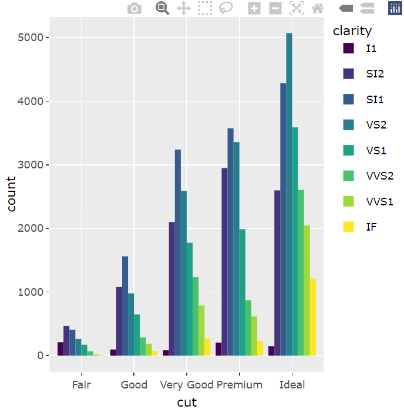
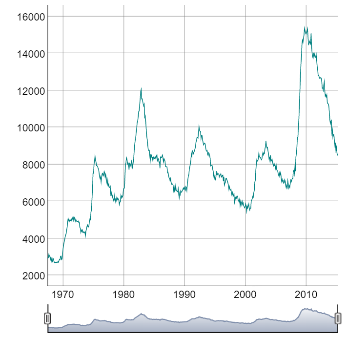
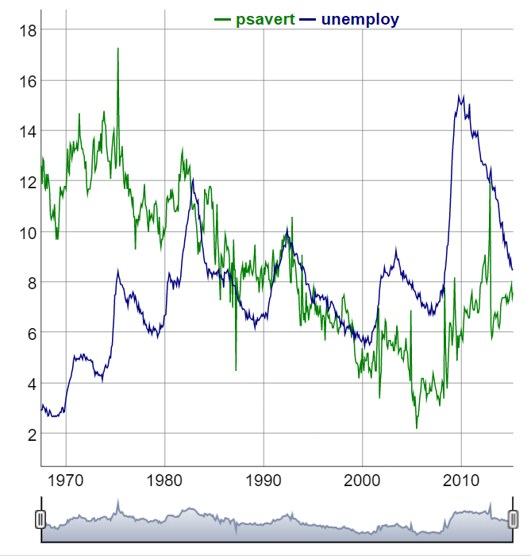

### 인터랙티브 그래프
- 마우스 움직임에 반응하여 실시간으로 형태가 변하는 그래프
```
install.packages("plotly")
library(plotly)

library(ggplot2)
p <- ggplot(data = mpg, aes(x = displ, y = hwy, col = drv)) + geom_point()

ggplotly(p)

p <- ggplot(data = diamonds, aes(x = cut, fill = clarity)) + 
  geom_bar(position = "dodge")

ggplotly(p) # 인터랙티브 그래프
```


- install.packages("dygraphs") : 인터랙티브 시계열 그래프 만드는 패키지
```r
library(dygraphs)

economics <- ggplot2::economics
head(economics)
#   A tibble: 6 × 6
#   date         pce    pop psavert uempmed unemploy
#   <date>     <dbl>  <dbl>   <dbl>   <dbl>    <dbl>
# 1 1967-07-01  507. 198712    12.6     4.5     2944
# 2 1967-08-01  510. 198911    12.6     4.7     2945
# 3 1967-09-01  516. 199113    11.9     4.6     2958
# 4 1967-10-01  512. 199311    12.9     4.9     3143
# 5 1967-11-01  517. 199498    12.8     4.7     3066
# 6 1967-12-01  525. 199657    11.8     4.8     3018

library(xts)
eco <- xts(economics$unemploy, order.by = economics$date)
head(eco)

# dyRangeSelector() : 날짜 범위 선택 기능
dygraph(eco) %>% dyRangeSelector()
```


```r
# 저축률 
eco_a <- xts(economics$psavert, order.by = economics$date)

# 실업자 수
eco_b <- xts(economics$unemploy/1000, order.by = economics$date)

eco2 <- cbind(eco_a, eco_b)                 # 데이터 결합
colnames(eco2) <- c("psavert", "unemploy")  # 변수명 바꾸기
head(eco2)

dygraph(eco2) %>% dyRangeSelector()
```
