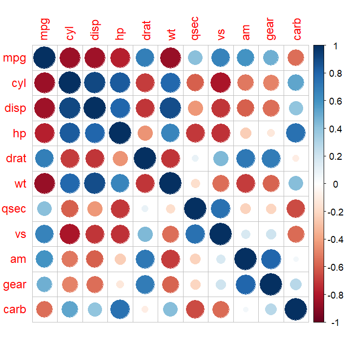
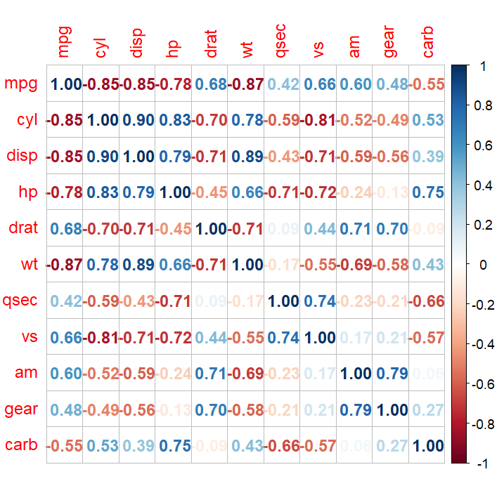
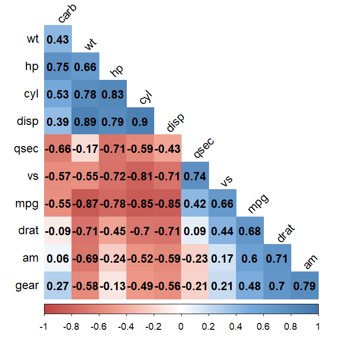

### 통계적 가설 검정
- 기술 통계 : 데이터를 요약해 설명하는 통계 기법
- 추론 통계 : 단순히 숫자를 요약하는 것을 넘어 어떤 값이 발생할 확률을 계산하는 통계
- 통계적 가설 검정 : 유의 확률을 이용해 가설을 검정하는 방법
  - 유의 확률 : 실제로는 집단 간 차이가 없지만 우연히 차이가 있는 데이터가 추출될 확률

### t 검정
- 두 집단의 평균에 통계적으로 유의한 차이가 있는지 알아볼 때 사용하는 통계 분석 기법
- compact 자동차와 suv 자동차의 도시 연비 t검정
```r
mpg <- as.data.frame(ggplot2::mpg)

library(dplyr)
mpg_diff <- mpg %>% 
  select(class, cty) %>% 
  filter(class %in% c("compact", "suv"))

head(mpg_diff)
# class cty
# 1 compact  18
# 2 compact  21
# 3 compact  20
# 4 compact  21
# 5 compact  16
# 6 compact  18
table(mpg_diff$class) 
# compact     suv 
#      47      62 

t.test(data = mpg_diff, cty ~ class, var.equal = T)
# p-value < 2.2e-16, 통계적으로 유의
# sample estimates: 각 집단의 cty 평균
# mean in group compact     mean in group suv 
#              20.12766              13.50000 

```
- 일반 휘발유와 고급 휘발유의 도시 연비 t검정
```r
mpg_diff2 <- mpg %>% 
  select(fl, cty) %>% 
  filter(fl %in% c("r", "p"))  # r:regular, p:premium

table(mpg_diff2$fl)
#   p   r 
#  52 168 

t.test(data = mpg_diff2, cty ~ fl, var.equal = T)
# Two Sample t-test
# 
# data:  cty by fl
# t = 1.0662, df = 218, p-value = 0.2875
# alternative hypothesis: true difference in means between group p and group r is not equal to 0
# 95 percent confidence interval:
# -0.5322946  1.7868733
# sample estimates:
# mean in group p mean in group r 
# 17.36538        16.73810
```

### 상관분석
- 두 연속 변수가 서로 관련이 있는지 검정하는 통계 분석 기법
- cor() : 상관행렬 생성 함수

- 실업자 수와 개인 소비 지출의 상관관계
```r
economics <- as.data.frame(ggplot2::economics)
cor.test(economics$unemploy, economics$pce)
# Pearson's product-moment correlation
# 
# data:  economics$unemploy and economics$pce
# t = 18.63, df = 572, p-value < 2.2e-16
# alternative hypothesis: true correlation is not equal to 0
# 95 percent confidence interval:
#  0.5608868 0.6630124
# sample estimates:
#       cor 
# 0.6145176 

head(mtcars)
#                    mpg cyl disp  hp drat    wt  qsec vs am gear carb
# Mazda RX4         21.0   6  160 110 3.90 2.620 16.46  0  1    4    4
# Mazda RX4 Wag     21.0   6  160 110 3.90 2.875 17.02  0  1    4    4
# Datsun 710        22.8   4  108  93 3.85 2.320 18.61  1  1    4    1
# Hornet 4 Drive    21.4   6  258 110 3.08 3.215 19.44  1  0    3    1
# Hornet Sportabout 18.7   8  360 175 3.15 3.440 17.02  0  0    3    2
# Valiant           18.1   6  225 105 2.76 3.460 20.22  1  0    3    1

car_cor <- cor(mtcars)  # 상관행렬 생성
round(car_cor, 2)       # 소수점 셋째 자리에서 반올림해서 출력
#        mpg   cyl  disp    hp  drat    wt  qsec    vs    am  gear  carb
# mpg   1.00 -0.85 -0.85 -0.78  0.68 -0.87  0.42  0.66  0.60  0.48 -0.55
# cyl  -0.85  1.00  0.90  0.83 -0.70  0.78 -0.59 -0.81 -0.52 -0.49  0.53
# disp -0.85  0.90  1.00  0.79 -0.71  0.89 -0.43 -0.71 -0.59 -0.56  0.39
# hp   -0.78  0.83  0.79  1.00 -0.45  0.66 -0.71 -0.72 -0.24 -0.13  0.75
# drat  0.68 -0.70 -0.71 -0.45  1.00 -0.71  0.09  0.44  0.71  0.70 -0.09
# wt   -0.87  0.78  0.89  0.66 -0.71  1.00 -0.17 -0.55 -0.69 -0.58  0.43
# qsec  0.42 -0.59 -0.43 -0.71  0.09 -0.17  1.00  0.74 -0.23 -0.21 -0.66
# vs    0.66 -0.81 -0.71 -0.72  0.44 -0.55  0.74  1.00  0.17  0.21 -0.57
# am    0.60 -0.52 -0.59 -0.24  0.71 -0.69 -0.23  0.17  1.00  0.79  0.06
# gear  0.48 -0.49 -0.56 -0.13  0.70 -0.58 -0.21  0.21  0.79  1.00  0.27
# carb -0.55  0.53  0.39  0.75 -0.09  0.43 -0.66 -0.57  0.06  0.27  1.00
```

- 상관행렬 그래프 생성
- install.packages("corrplot") : 상관행렬 그래프 생성을 위한 패키지
```r
library(corrplot)

corrplot(car_cor)
```


```r
corrplot(car_cor, method = "number") # 원 대신 상관계수값으로 생성
```


```r
col <- colorRampPalette(c("#BB4444", "#EE9988", "#FFFFFF", "#77AADD", "#4477AA"))

corrplot(car_cor,
         method = "color",       # 색깔로 표현
         col = col(200),         # 색상 200개 선정
         type = "lower",         # 왼쪽 아래 행렬만 표시
         order = "hclust",       # 유사한 상관계수끼리 군집화
         addCoef.col = "black",  # 상관계수 색깔
         tl.col = "black",       # 변수명 색깔
         tl.srt = 45,            # 변수명 45도 기울임
         diag = F)               # 대각 행렬 제외
```
