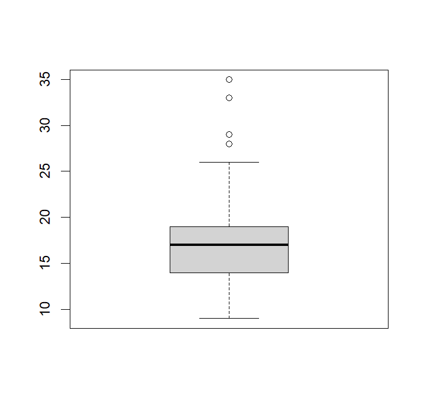

### 행 추출
```r
exam <- read.csv("csv_exam.csv")
```

- 행 번호로 추출
```r
exam[]    # 조건 없이 전체 데이터 출력
exam[1,]  # 1행 추출
exam[2,]  # 2행 추출
```

- 조건에 충족하는 행 추출
```r
exam[exam$class == 1,]  # class가 1인 행 추출
exam[exam$math >= 80,]  # 수학점수가 80점 이상인 행 추출

# 1반 이면서 수학점수가 50점 이상
exam[exam$class == 1 & exam$math >= 50,]

# 영어점수가 90점 미만이거나 과학점수가 50점 미만
exam[exam$english < 90 | exam$science < 50,]
```

### 열 추출

- 열 번호로 추출
```r
exam[,1]  # 첫 번째 열 추출
exam[,2]  # 두 번째 열 추출
exam[,3]  # 세 번째 열 추출
```

- 조건에 충족하는 열 추출
```r
exam[, "class"]  # class 변수 추출
exam[, "math"]   # math 변수 추출

exam[,c("class", "math", "english")]  # class, math, english 변수 추출
```

### 헹, 열 추출

- 행, 열 번호로 추출
```r
# 행, 변수 모두 인덱스
exam[1,3]

# 행 인덱스, 열 변수명
exam[5, "english"]
```

- 조건에 충족하는 행, 열 추출
```r
# 행 부등호 조건, 열 변수명
exam[exam$math >= 50, "english"]

# 행 부등호 조건, 열 변수명
exam[exam$math >= 50, c("english", "science")]
```

- dplyr과 내장 함수의 차이 : 가독성의 차이, dplyr 코드가 논리의 흐름대로 구조화 되어있기 때문에 가독성이 높고 이해하기 쉬움
```r
# 내장 함수 코드
exam$tot <- (exam$math + exam$english + exam$science)/3
aggregate(data=exam[exam$math >= 50 & exam$english >= 80,], tot~class, mean) # 범주형 요약 통계량을 구하는 내장 함수

# dplyr 코드
exam %>%
  filter(math >= 50 & english >= 80) %>%
  mutate(tot = (math + english + science)/3) %>%
  group_by(class) %>%
  summarise(mean = mean(tot))
```

### 변수 타입
- 연속 변수 : Numeric
```r
var1 <- c(1,2,3,1,2)          # numeric 변수 생성
var1  # numeric 변수 출력
# [1] 1 2 3 1 2

var1+2  # numeric 변수로 연산
# [1] 3 4 5 3 4

class(var1) # "numeric"
levels(var1) # 범주 구성 확인, NULL

mean(var1)
# [1] 1.8
```

- 범주 변수 : Factor
```r
var2 <- factor(c(1,2,3,1,2))  # factor 변수 생성
var2  # factor 변수 출력
# [1] 1 2 3 1 2
# Levels: 1 2 3

var2+2  # factor 변수로 연산
# [1] NA NA NA NA NA
# Warning message:
# In Ops.factor(var2, 2) : 요인(factors)에 대하여 의미있는 ‘+’가 아닙니다.

class(var2) # "Factor"
levels(var2) # [1] "1", "2", "3"

mean(var2)
# [1] NA
```

- 문자로 구성된 factor 변수
```r
var3 <- c("a", "b", "b", "c")          # 문자 변수 생성
var4 <- factor(c("a", "b", "b", "c"))  # 문자로 된 factor 변수 생성

var3
# [1] "a" "b" "b" "c"
var4 # factor 변수로 만들 시 Levels가 같이 출력
# [1] a b b c
# Levels: a b c

class(var3)
# "character"
class(var4)
# "factor"
```

- 변수 타입 바꾸기
  - as.numeric()
  - as.factor()
  - as.character()
  - as.Date()
  - as.data.frame()
```r
var2 <- as.numeric(var2)  # numeric 타입으로 변환
mean(var2)                # 함수 재적용
class(var2)               # 타입 확인
levels(var2)              # 범주 확인
```

- 다양한 변수 타입
  - numeric : 실수
  - integer : 정수
  - complex : 복소수 (3 + 2i)
  - character : 문자
  - logical : 논리
  - factor : 범주
  - Date : 날짜

### 데이터 구조
- 벡터 : 하나의 값 또는 여러 개의 값으로 구성된 데이터 구조
  -  한 가지 타입으로만 구성할 수 있음
```r
# 벡터 만들기
a <- 1
a
# [1] 1

b <- "hello"
b
# [1] "hello"

# 데이터 구조 확인 
class(a)
# "numeric"

class(b)
# "character"
```

- 데이터프레임 : 행과 열로 구성된 2차원 데이터 구조
  - 다양한 변수 타입으로 구성 가능
```r
# 데이터프레임 만들기
x1 <- data.frame(var1 = c(1,2,3),
                 var2 = c("a","b","c"))
x1
#   var1 var2
# 1    1    a
# 2    2    b
# 3    3    c

# 데이터 구조 확인
class(x1)
# "data.frame"
```

- 매트릭스 : 한 가지 변수 타입으로만 구성할 수 있는 행과 열로 구성된 2차원 데이터 구조
```r
# 매트릭스 만들기 - 1~12로 2열
x2 <- matrix(c(1:12), ncol = 2)
x2
#      [,1] [,2]
# [1,]    1    7
# [2,]    2    8
# [3,]    3    9
# [4,]    4   10
# [5,]    5   11
# [6,]    6   12

# 데이터 구조 확인
class(x2)
# "matrix" "array" 
```

- 어레이 : 2차원 이상으로 구성된 매트릭스
```r
# array 만들기 - 1~20으로 2행 x 5열 x 2차원
x3 <- array(1:20, dim = c(2, 5, 2))
x3
# , , 1
# 
# [,1] [,2] [,3] [,4] [,5]
# [1,]    1    3    5    7    9
# [2,]    2    4    6    8   10
# 
# , , 2
# 
# [,1] [,2] [,3] [,4] [,5]
# [1,]   11   13   15   17   19
# [2,]   12   14   16   18   20

# 데이터 구조 확인
class(x3)
# "array"
```

- 리스트 : 모든 데이터 구조를 포함하는 데이터 구조
```r
# 리스트 생성 - 앞에서 생성한 데이터 구조 활용
x4 <- list(f1 = a,   # 벡터
           f2 = x1,  # 데이터 프레임
           f3 = x2,  # 매트릭스
           f4 = x3)  # 어레이
x4
# $f1
# [1] 1
# 
# $f2
# var1 var2
# 1    1    a
# 2    2    b
# 3    3    c
# 
# $f3
# [,1] [,2]
# [1,]    1    7
# [2,]    2    8
# [3,]    3    9
# [4,]    4   10
# [5,]    5   11
# [6,]    6   12
# 
# $f4
# , , 1
# 
# [,1] [,2] [,3] [,4] [,5]
# [1,]    1    3    5    7    9
# [2,]    2    4    6    8   10
# 
# , , 2
# 
# [,1] [,2] [,3] [,4] [,5]
# [1,]   11   13   15   17   19
# [2,]   12   14   16   18   20

# 데이터 구조 확인
class(x4)
# "list"
```

- 리스트 구조를 다루는 문법을 이용하면 원하는 값을 추출할 수 있음
```r
mpg <- ggplot2::mpg
x <- boxplot(mpg$cty)
x
# $stats
# [,1]
# [1,]    9
# [2,]   14
# [3,]   17
# [4,]   19
# [5,]   26
# 
# $n
# [1] 234
# 
# $conf
# [,1]
# [1,] 16.48356
# [2,] 17.51644
# 
# $out
# [1] 28 28 33 35 29
# 
# $group
# [1] 1 1 1 1 1
# 
# $names
# [1] "1"

x$stats[,1]     # 요약 통계량 추출
# [1]  9 14 17 19 26
x$stats[,1][3]  # 중앙값 추출
# [1] 17
x$stats[,1][2]  # 1분위수 추출
# [1] 14
```
