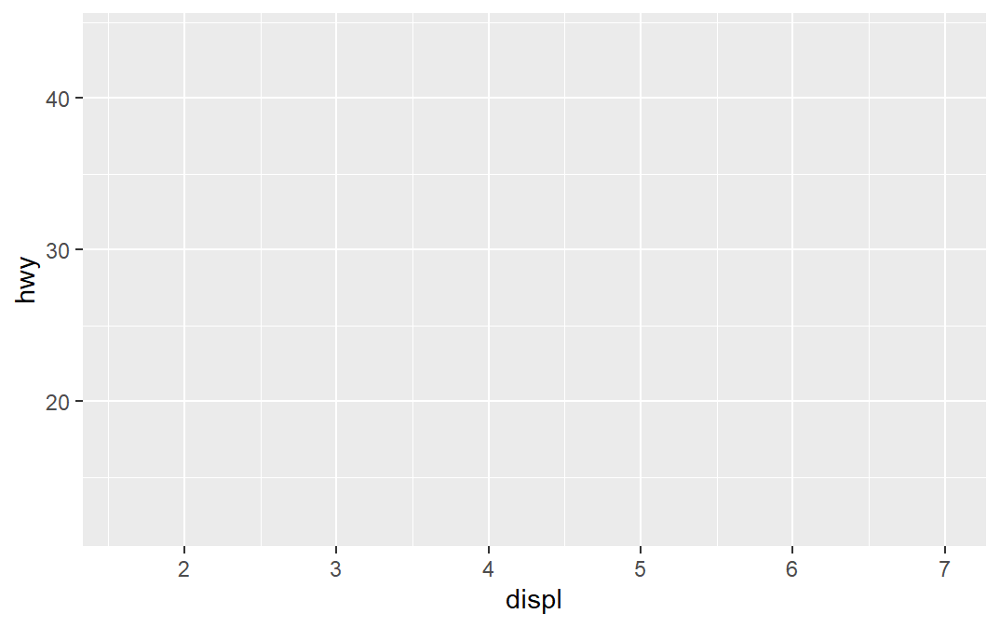
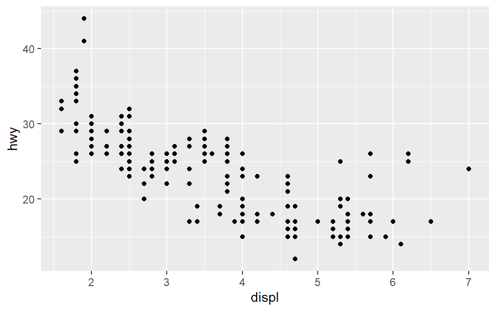
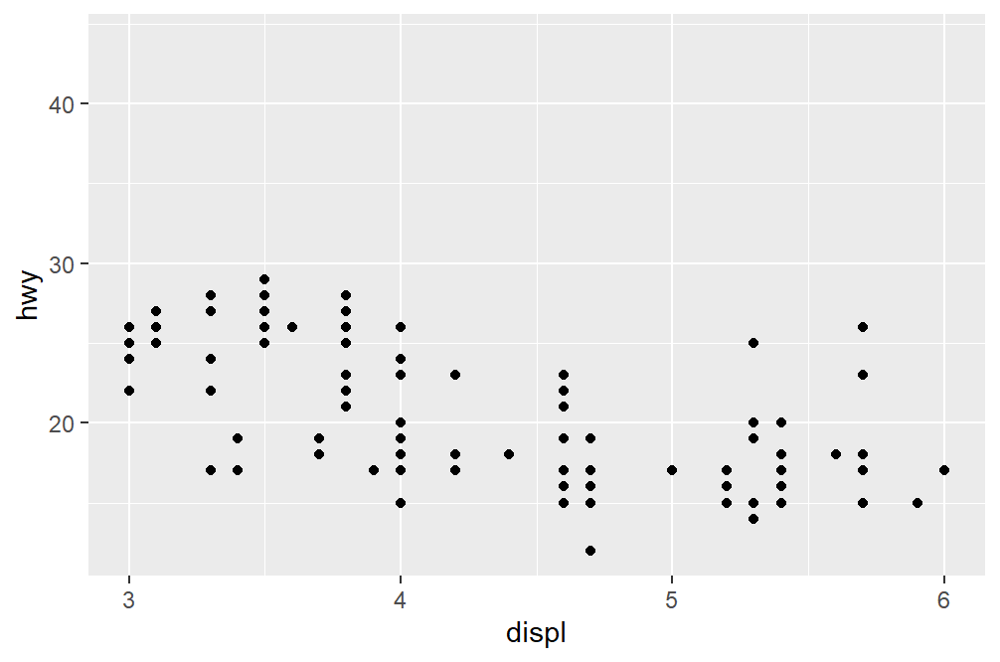
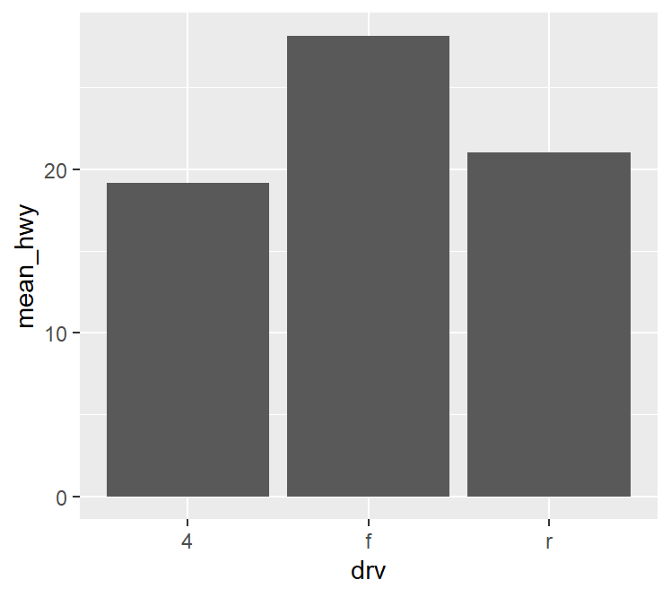
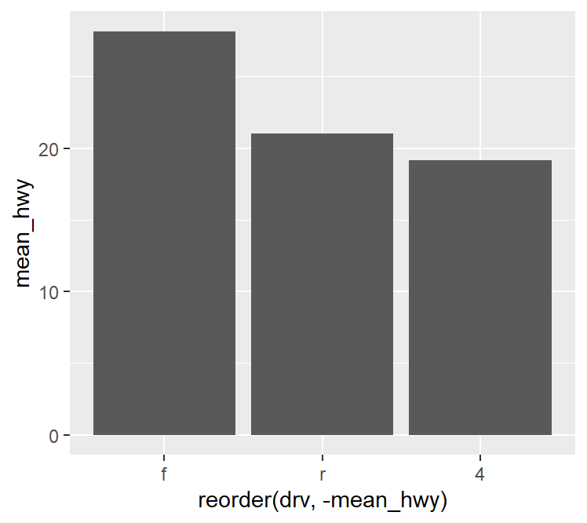
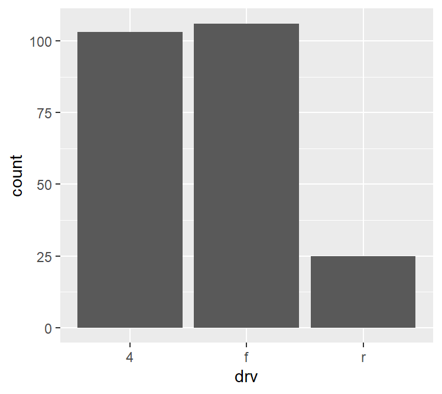
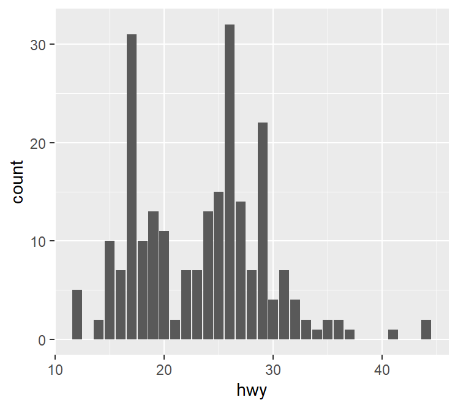
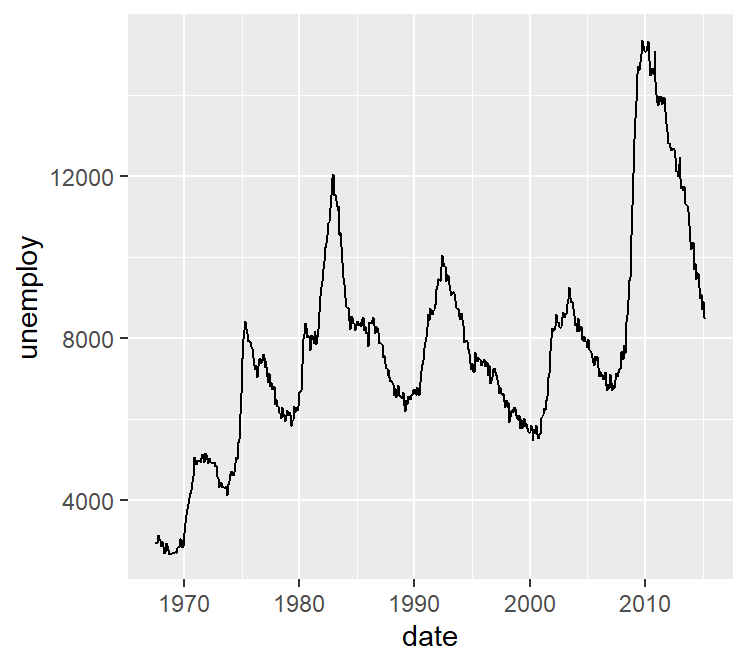
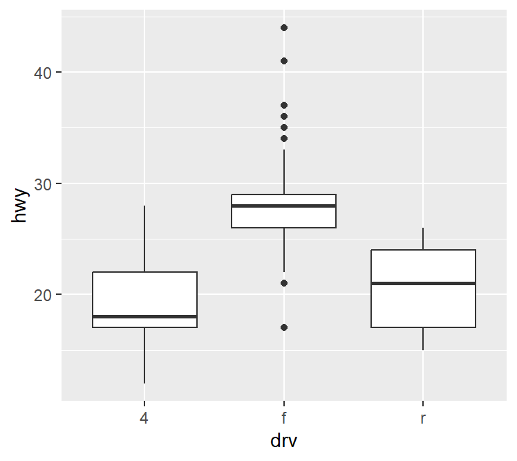

### 그래프 만들기
- ggplot2 패키지를 이용해 그래프를 만들 수 있음
- ggplot() : 플롯 창에 배경 그림 생성
```r
library(ggplot2)
ggplot(data = mpg, aes(x = displ, y = hwy)) # 배경 설정
```


#### 산점도
- 변수 간 관계 표현을 확인할 수 있음
- geom_point() : 산점도를 표현
```r
ggplot(data = mpg, aes(x = displ, y = hwy)) +
  geom_point()
```


- xlim() : x축 범위 지정
- ylim() : y축 범위 지정
```r
ggplot(data = mpg, aes(x = displ, y = hwy)) +
  geom_point() +
  xlim(3,6)
```


#### 막대 그래프
- 집단 간 차이를 표현할 때 주로 사용
- 평균 막대 그래프
  - geom_col() : 값의 평균으로 막대의 길이를 표현
  ```r
  # 집단별 평균표 만들기
  library(dplyr)

  df_mpg <- mpg %>% 
    group_by(drv) %>% 
    summarise(mean_hwy = mean(hwy))

  df_mpg

  #  A tibble: 3 × 2
  #  drv   mean_hwy
  #  <chr>    <dbl>
  # 1 4        19.2
  # 2 f        28.2
  # 3 r        21  
  ```

  ```r
  ggplot(data = mpg, aes(x = displ, y = hwy)) +
    geom_col()
  ```
  

  ```r
  ggplot(data = df_mpg, aes(x = reorder(drv, -mean_hwy), y = mean_hwy)) +
    geom_col()
  ```
  

- 빈도 막대 그래프
  - geom_bar() : 값의 빈도로 막대의 길이를 표현
  ```r
  ggplot(data = mpg, aes(x = drv)) +
    geom_bar()
  ```
  

  ```r
  ggplot(data = mpg, aes(x = hwy)) +
    geom_bar()
  ```
  

#### 선 그래프
- 데이터를 선으로 표현한 그래프
- 시계열 데이터 : 일정 시간 간격을 두고 나열된 데이터
- 시계열 그래프 : 시계열 데이터를 선으로 표현한 그래프
- geom_line() : 선 그래프를 표현
```r
ggplot(data = economics, aes(x = date, y = unemploy)) +
  geom_line()
```


#### 상자 그림
- 데이터의 분포를 직사각형 상자 모양으로 표현한 그래프
- geom_boxplot() : 상자 그림을 표현
  - 상자 아래 세로선(아랫수염) : 하위 0~25% 내에 해당하는 값
  - 상자 밑면(1사분위수(Q1)) : 하위 25% 위치 값
  - 상자 내 굵은 선(2사분위수(Q2)) : 하위 50% 위치 값(중앙값)
  - 상자 윗면(3사분위수(Q3)) : 하위 75% 위치 값
  - 상자 위 세로선(윗수염) : 하위 75~100% 내에 해당하는 값
  - 상자 밖 점 표식(극단치) Q1, Q3 밖 1.5 IQR을 벗어난 값
```r
ggplot(data = mpg, aes(x = drv, y = hwy)) +
  geom_boxplot()
```
