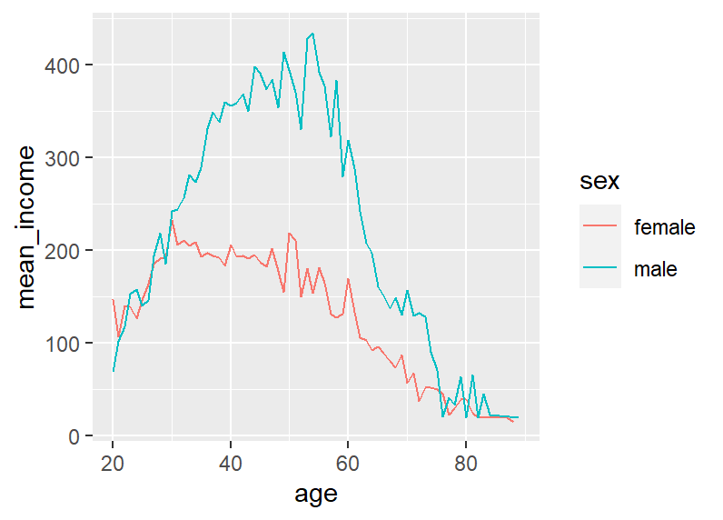

### 한국복지패널 데이터 준비
- [Koweps_hpc10_2015_beta1.sav](https://bit.ly/Koweps_hpc10_2015_v2)
- install.packages("foreign") : SPSS, SAS, STATA 등 다양한 통계분석 소프트웨어 파일을 불러올 수 있음
- 사용하는 라이브러리
```{r}
library(foreign) # SPSS 파일 불러오기
library(dplyr) # 전처리
library(ggplot2) # 시각화
library(readxl) # 엑셀 파일 불러오기
```

- 데이터 불러오기
```{r}
raw_welfare <- read.spss(file = "./Data/Koweps_hpc10_2015_beta1.sav", to.data.frame = T) # nolint
welfare <- raw_welfare
```

- 데이터 검토하기
```{r}
head(welfare)
tail(welfare)
View(welfare)
dim(welfare)
str(welfare)
summary(welfare)

#  $ h10_id          : num  1 2 3 4 4 6 6 6 6 6 ...
#  $ h10_ind         : num  1 1 1 1 1 1 1 1 1 1 ...
#  $ h10_sn          : num  1 1 1 1 1 1 1 1 1 1 ...
#  $ h10_merkey      : num  10101 20101 30101 40101 40101 ...
#  $ h_new           : num  0 0 0 0 0 0 0 0 0 0 ...
#  $ h10_cobf        : num  NA NA NA NA NA NA NA NA NA NA ...
#  $ h10_reg5        : num  1 1 1 1 1 1 1 1 1 1 ...
#  $ h10_reg7        : num  1 1 1 1 1 1 1 1 1 1 ...
#  $ h10_din         : num  864 600 1571 3579 3579 ...
#  $ h10_cin         : num  864 600 1619 3687 3687 ...
#  $ h10_flag        : num  0 0 0 0 0 0 0 0 0 0 ...
#  $ p10_wgl         : num  777 960 1059 1012 1075 ...
#  $ p10_wsl         : num  0.257 0.317 0.35 0.334 0.355 ...
#  $ p10_wgc         : num  764 949 1048 992 1057 ...
#  $ p10_wsc         : num  0.252 0.314 0.346 0.328 0.349 ...
#  $ h10_hc          : num  2 2 1 1 1 1 1 1 1 1 ...
#  $ nh1001_1        : num  NA NA NA NA NA NA NA NA NA NA ...
#  $ nh1001_2        : num  NA NA NA NA NA NA NA NA NA NA ...
#  $ h1001_1         : num  1 1 1 2 2 5 5 5 5 5 ...
#  $ h10_pind        : num  1 1 1 1 4 1 1 1 1 1 ...
#  $ h10_pid         : num  101 201 301 401 402 601 602 603 604 605 ...
#  $ h10_g1          : num  1 1 1 1 2 1 2 3 4 5 ...
#  $ h10_g2          : num  10 10 10 10 2 10 20 11 1 2 ...
#  $ h10_g3          : num  2 2 1 1 2 1 2 2 1 2 ...
#  $ h10_g4          : num  1936 1945 1948 1942 1923 ...
#  $ h10_g6          : num  2 4 3 7 2 6 5 3 4 4 ...
#  $ h10_g7          : num  0 5 5 3 0 5 5 1 5 5 ...
#  $ h10_g8          : num  0 0 0 0 0 0 0 0 0 0 ...
#  $ h10_g9          : num  0 0 0 0 0 0 0 0 0 0 ...
#  $ h10_g10         : num  2 2 2 3 2 1 1 0 1 1 ...
#  $ h10_g11         : num  2 2 2 1 1 1 1 1 1 1 ...
#  $ h10_g12         : num  1 1 1 1 1 1 1 1 1 1 ...
#  $ h1001_110       : num  1 1 1 5 5 5 5 5 5 5 ...
#  $ h1001_5aq1      : num  0 0 0 0 0 0 0 0 0 0 ...
#  $ h1001_5aq2      : num  0 0 0 0 0 0 0 0 0 0 ...
#  $ h1001_5aq3      : num  0 0 0 0 0 0 0 0 0 0 ...
#  $ h1001_5aq4      : num  0 0 0 0 0 0 0 0 0 0 ...
#  $ h10_med1        : num  1 1 1 1 2 1 2 3 4 5 ...
#  $ h10_med2        : num  3 4 3 3 4 3 5 2 3 3 ...
#  $ h10_med3        : num  60 28 12 3 6 5 0 3 0 14 ...
#  $ h10_med4        : num  0 0 0 0 0 0 5 0 0 0 ...
#  $ h10_med5        : num  0 0 0 0 0 0 23 0 0 0 ...
#  $ h10_med6        : num  0 0 0 0 0 0 1 0 0 0 ...
#  $ h10_med7        : num  3 2 2 1 1 2 1 2 0 2 ...
#  $ h10_med8        : num  0 1 0 1 1 1 1 0 0 1 ...
#  $ h10_g9_1        : num  3 3 3 3 3 3 3 0 0 3 ...
#  $ h10_med9        : num  8 5 7 3 15 23 1 0 0 6 ...
#  $ h10_med10       : num  0 0 0 0 0 1 1 1 0 0 ...
#  $ h10_eco1        : num  1 1 1 1 2 1 2 3 4 5 ...
#  $ h10_eco2        : num  2 3 1 1 3 1 1 0 3 3 ...
#  $ h10_eco3        : num  NA NA NA NA NA NA NA NA NA NA ...
#  $ h10_eco4        : num  9 9 2 2 9 6 9 NA 9 9 ...
#  $ h10_eco4_1      : num  NA NA NA NA NA NA NA NA NA NA ...
#  $ h10_eco5_1      : num  NA NA 1 1 NA NA NA NA NA NA ...
#  $ h10_eco6        : num  NA NA 2 2 NA NA NA NA NA NA ...
#  $ h10_eco_7_1     : num  NA NA 1 1 NA NA NA NA NA NA ...
#  $ h10_eco_7_2     : num  NA NA 2 2 NA NA NA NA NA NA ...
#  $ h10_eco_7_3     : num  NA NA 1 3 NA NA NA NA NA NA ...
#  $ h10_eco8        : num  NA NA 75 42 NA 46 NA NA NA NA ...
#  $ h10_eco9        : num  NA NA 942 762 NA 530 NA NA NA NA ...
#  $ h10_eco10       : num  NA NA 3 2 NA 1 NA NA NA NA ...
#  $ h10_eco11       : num  10 10 NA NA 10 NA 6 NA 10 10 ...
#  $ h10_soc1        : num  1 1 1 1 2 1 2 3 4 5 ...
#  $ h10_soc_2       : num  0 0 0 1 0 2 0 0 0 0 ...
#  $ h10_soc_3       : num  NA NA NA NA NA 1 NA NA NA NA ...
#  $ h10_soc_4       : num  NA NA NA NA NA 2 NA NA NA NA ...
#  $ h10_soc_5       : num  NA NA NA NA NA 1 NA NA NA NA ...
#  $ h10_soc_6       : num  NA NA NA NA NA NA NA NA NA NA ...
#  $ h10_soc_7       : num  NA NA NA NA NA NA NA NA NA NA ...
#  $ h10_soc_8       : num  NA NA NA NA NA NA NA NA NA NA ...
#  $ h10_soc_9       : num  NA NA NA NA NA 0 NA NA NA NA ...
#  $ h10_soc_10      : num  NA NA NA NA NA 0 NA NA NA NA ...
#  $ h10_soc_11      : num  NA NA NA NA NA NA NA NA NA NA ...
#  $ h10_soc8        : num  0 0 1 2 0 0 0 0 0 0 ...
#  $ h10_soc9        : num  0 0 1 2 0 0 0 0 0 0 ...
#  $ h10_soc11       : num  0 0 2 2 0 0 0 0 0 0 ...
#  $ h10_soc10       : num  0 0 2 2 0 0 0 0 0 0 ...
#  $ h10_soc_12      : num  4 4 4 4 4 4 4 4 4 4 ...
#  $ h10_soc_13      : num  4 4 1 3 4 3 4 4 4 4 ...
#  $ h1005_1         : num  1 1 1 1 1 1 1 1 1 1 ...
#  $ h1005_3aq1      : num  2 2 1 2 2 2 2 2 2 2 ...
#  $ h1005_2         : num  NA NA NA NA NA NA NA NA NA NA ...
#  $ h1005_3         : num  NA NA NA NA NA NA NA NA NA NA ...
#  $ h1005_4         : num  2 2 2 2 2 2 2 2 2 2 ...
#  $ h1005_5         : num  NA NA NA NA NA NA NA NA NA NA ...
#  $ h1005_6         : num  NA NA NA NA NA NA NA NA NA NA ...
#  $ h1005_7         : num  0 0 0 0 0 1 1 1 1 1 ...
#  $ nh1005_8        : num  4 3 3 3 3 3 3 3 3 3 ...
#  $ nh1005_9        : num  5 4 3 3 3 4 4 4 4 4 ...
#  $ h1005_3aq2      : num  0 0 0 0 0 11 11 11 11 11 ...
#  $ h1006_aq1       : num  2 2 2 2 2 2 2 2 2 2 ...
#  $ h1006_1         : num  2 2 2 1 1 2 2 2 2 2 ...
#  $ h1006_2         : num  3 3 1 3 3 3 3 3 3 3 ...
#  $ h1006_4         : num  2 3 1 3 3 3 3 3 3 3 ...
#  $ h1006_5         : num  33 198 23 73 73 82 82 82 82 82 ...
#  $ h1006_3         : num  2 1 3 1 1 1 1 1 1 1 ...
#  $ h1006_6         : num  5000 60000 200 20000 20000 50700 50700 50700 50700 50700 ...
#  $ h1006_8         : num  1 1 1 1 1 1 1 1 1 1 ...
#  $ h1006_9         : num  88 4 88 88 88 88 88 88 88 88 ...
```

- 변수명 바꾸기 : Koweps_Codebook.xlsx을 통해 변수의 특성 확인 가능
```{r}
welfare <- rename(welfare,
  sex = h10_g3,
  birth = h10_g4,
  marriage = h10_g10,
  religion = h10_g11,
  income = p1002_8aq1,
  code_job = h10_eco9,
  code_region = h10_reg7
)
```

### 데이터 분석
- 변수 검토 및 전처리하고 관계를 분석
#### 성별에 따른 월급 차이
- 성별 변수 검토 및 전처리
  - 성별 변수 타입 확인
    ```{r}
    class(welfare$sex)
    # "numeric"
    ```
  - 성별 이상치 확인
    ```{r}
    table(welfare$sex)
    #    1    2 
    # 7578 9086 
    ```
  - 이상치 처리 후 확인
    ```{r}
    welfare$sex <- ifelse(welfare$sex == 9, NA, welfare$sex)
    table(is.na(welfare$sex))
    # FALSE 
    # 16664 
    ```
  - 1인 경우 male, 2인 경우 female로 전처리 후 qplot()로 확인
    ```{r}
    welfare$sex <- ifelse(welfare$sex == 1, "male", "female")
    qplot(welfare$sex)
    ```
    
- 월급 변수 검토 및 전처리
    - 월급 변수 타입 및 분포 확인
    ```{r}
    class(welfare$income)
    summary(welfare$income)
    # Min. 1st Qu.  Median    Mean 3rd Qu.    Max.    NA's 
    # 0.0   122.0   192.5   241.6   316.6  2400.0   12030 
    qplot(welfare$income) + xlim(0, 1000) # 0 ~ 1000만원 분포 확인
    ```
    
    - 이상치 확인 후 전처리 : 0 또는 9999일 경우 NA로 처리
    ```{r}
    welfare$income <-
        ifelse(welfare$income %in% c(0, 9999), NA, welfare$income)
    table(is.na(welfare$income))
    # FALSE  TRUE 
    #  4634 12030 
    ```
- 성별에 따른 월급 차이 분석
```
sex_income <- welfare %>%
  filter(!is.na(income)) %>%
  group_by(sex) %>%
  summarise(mean_income = mean(income))
sex_income
#   A tibble: 2 × 2
#   sex    mean_income
#   <chr>        <dbl>
# 1 female        162.
# 2 male          312.
ggplot(data = sex_income, aes(x = sex, y = mean_income)) + geom_col()
```


#### 나이와 월급의 관계
- 나이 변수 검토
```{r}
class(welfare$birth)
# "numeric"
summary(welfare$birth)
#    Min. 1st Qu.  Median    Mean 3rd Qu.    Max. 
#    1907    1946    1966    1968    1988    2014 
qplot(welfare$birth)
```

- 나이 변수 전처리
```{r}
welfare$birth <- ifelse(welfare$birth == 9999, NA, welfare$birth)
table(is.na(welfare$birth))
# FALSE 
# 16664 
```
- 나이 파생변수 만들기
```
welfare$age <- 2015 - welfare$birth + 1
summary(welfare$age)
#    Min. 1st Qu.  Median    Mean 3rd Qu.    Max. 
#    2.00   28.00   50.00   48.43   70.00  109.00 
qplot(welfare$age)
```


- 나이와 월급 관계 분석
```{r}
age_income <- welfare %>%
  filter(!is.na(income)) %>%
  group_by(age) %>%
  summarise(mean_income = mean(income))
head(age_income)
#   A tibble: 6 × 2
#     age mean_income
#   <dbl>       <dbl>
# 1    20        121.
# 2    21        106.
# 3    22        130.
# 4    23        142.
# 5    24        134.
# 6    25        145.
ggplot(data = age_income, aes(x = age, y = mean_income)) + geom_line()
```


#### 연령대에 따른 월급 차이
- 연령대 파생변수 만들기
  - 초년 : 30세 미만 / 중년 : 30 ~ 59세 / 노년 60세 이상
```{r}
welfare <- welfare %>%
  mutate(ageg = ifelse(age < 30, "young",
                       ifelse(age <= 59, "middle", "old")))
table(welfare$ageg)
# middle    old  young 
#   6049   6281   4334 
qplot(welfare$ageg)
```

- 연령대에 따른 월급 차이 분석
```{r}
ageg_income <- welfare %>%
  filter(!is.na(income)) %>%
  group_by(ageg) %>%
  summarise(mean_income = mean(income))
ageg_income
#   A tibble: 3 × 2
#   ageg   mean_income
#   <chr>        <dbl>
# 1 middle        281.
# 2 old           125.
# 3 young         164.

# 막대 변수 정렬 기본값은 알파벳 순서이기 때문에 초년, 중년, 노년 나이 순으로 정렬
ggplot(data = ageg_income, aes(x = ageg, y = mean_income)) +
  geom_col() +
  scale_x_discrete(limits = c("young", "middle", "old"))
```


#### 연령대 및 성별 월급 차이
- 연령대 및 성별 월급 평균표 만들기
```{r}
sex_income <- welfare %>%
  filter(!is.na(income)) %>%
  group_by(ageg, sex) %>%
  summarise(mean_income = mean(income))

sex_income
#  A tibble: 6 × 3
#  Groups:   ageg [3]
#   ageg   sex    mean_income
#   <chr>  <chr>        <dbl>
# 1 middle female       186. 
# 2 middle male         353. 
# 3 old    female        81.5
# 4 old    male         174. 
# 5 young  female       160. 
# 6 young  male         171. 
```

- 그래프 만들기
```{r}
ggplot(data = sex_income, aes(x = ageg, y = mean_income, fill = sex)) +
  geom_col(position = "dodge") + # 성별 분리해 표시
  scale_x_discrete(limits = c("young", "middle", "old"))
```

- 나이 및 성별 월급 차이 분석
```
sex_age <- welfare %>% 
  filter(!is.na(income)) %>% 
  group_by(age, sex) %>% 
  summarise(mean_income = mean(income))
head(sex_age)
#   A tibble: 6 × 3
#   Groups:   age [3]
#     age sex    mean_income
#   <dbl> <chr>        <dbl>
# 1    20 female        147.
# 2    20 male           69 
# 3    21 female        107.
# 4    21 male          102.
# 5    22 female        140.
# 6    22 male          118.
ggplot(data = sex_age, aes(x = age, y = mean_income, col = sex)) + geom_line()
```
