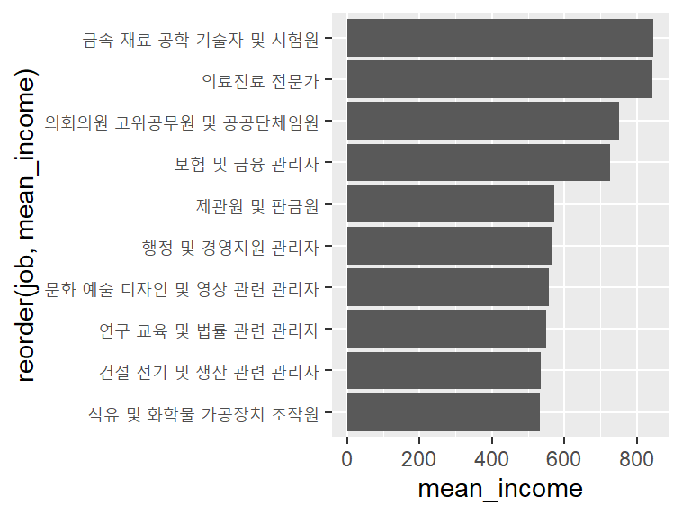
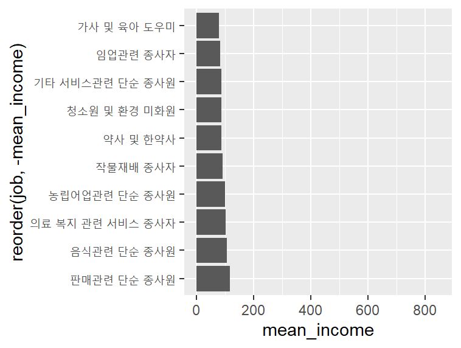
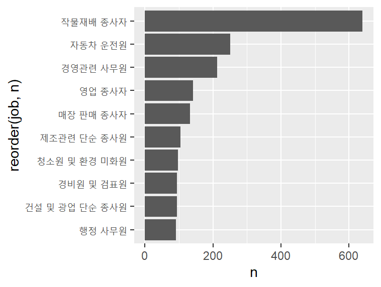
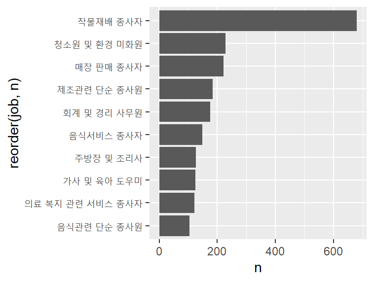

#### 직업별 월급 차이
- 직업 변수 검토
```r
class(welfare$code_job)
# "numeric"
table(welfare$code_job)
# 111  120  131  132  133  134  135  139  141  149  151  152  153  159  211
#   2   16   10   11    9    3    7   10   35   20   26   18   15   16    8   
# 212  213  221  222  223  224  231  232  233  234  235  236  237  239  241 
#   4    3   17   31   12    4   41    5    3    6   48   14    2   29   12
```
- 직업 변수 전처리
```r
list_job <-
  read_excel("Data/Koweps_Codebook.xlsx",
             col_names = T,
             sheet = 2)
head(list_job)
#  A tibble: 6 × 2
#   code_job job                                
#      <dbl> <chr>                              
# 1      111 의회의원 고위공무원 및 공공단체임원
# 2      112 기업고위임원                       
# 3      120 행정 및 경영지원 관리자            
# 4      131 연구 교육 및 법률 관련 관리자      
# 5      132 보험 및 금융 관리자                
# 6      133 보건 및 사회복지 관련 관리자       

dim(list_job)
# [1] 149   2
```
```r
welfare <- left_join(welfare, list_job, id = "code_job")
welfare %>% filter(!is.na(code_job)) %>%
  select(code_job, job) %>%
  head(10)
```

- 직업별 월급 차이 분석
```r
job_income <- welfare %>%
  filter(!is.na(job) & !is.na(income)) %>%
  group_by(job) %>%
  summarise(mean_income = mean(income))

head(job_income)
#   A tibble: 6 × 2
#   job                           mean_income
#   <chr>                               <dbl>
# 1 가사 및 육아 도우미                  80.2
# 2 간호사                              241. 
# 3 건설 및 광업 단순 종사원            190. 
# 4 건설 및 채굴 기계운전원             358. 
# 5 건설 전기 및 생산 관련 관리자       536. 
# 6 건설관련 기능 종사자                247. 
```

- 직업별 월급 상위 10개 직업
```r
top10 <- job_income %>% 
  arrange(desc(mean_income)) %>% 
  head(10)

top10
#   A tibble: 10 × 2
#    job                                  mean_income
#    <chr>                                      <dbl>
#  1 금속 재료 공학 기술자 및 시험원             845.
#  2 의료진료 전문가                             844.
#  3 의회의원 고위공무원 및 공공단체임원         750 
#  4 보험 및 금융 관리자                         726.
#  5 제관원 및 판금원                            572.
#  6 행정 및 경영지원 관리자                     564.
#  7 문화 예술 디자인 및 영상 관련 관리자        557.
#  8 연구 교육 및 법률 관련 관리자               550.
#  9 건설 전기 및 생산 관련 관리자               536.
# 10 석유 및 화학물 가공장치 조작원              532.

ggplot(data = top10, aes(x = reorder(job, mean_income), y = mean_income)) +
  geom_col() +
  coord_flip()
```


- 직업별 월급 하위 10개 직업
```r
bottom10 <- job_income %>% 
  arrange(mean_income) %>% 
  head(10)

bottom10
#   A tibble: 10 × 2
#    job                          mean_income
#    <chr>                              <dbl>
#  1 가사 및 육아 도우미                 80.2
#  2 임업관련 종사자                     83.3
#  3 기타 서비스관련 단순 종사원         88.2
#  4 청소원 및 환경 미화원               88.8
#  5 약사 및 한약사                      89  
#  6 작물재배 종사자                     92  
#  7 농립어업관련 단순 종사원           102. 
#  8 의료 복지 관련 서비스 종사자       104. 
#  9 음식관련 단순 종사원               108. 
# 10 판매관련 단순 종사원               117. 
ggplot(data = bottom10, aes(x = reorder(job, -mean_income), y = mean_income)) +
  geom_col() +
  coord_flip() +
  ylim(0, 850)
```


#### 성별 직업 빈도
- 남성 직업 빈도 상위 10개 추출
```r
job_male <- welfare %>%
  filter(!is.na(job) & sex == "male") %>%
  group_by(job) %>%
  summarise(n = n()) %>%
  arrange(desc(n)) %>%
  head(10)

job_male
#   A tibble: 10 × 2
#   job                          n
#   <chr>                    <int>
# 1 작물재배 종사자            640
# 2 자동차 운전원              251
# 3 경영관련 사무원            213
# 4 영업 종사자                141
# 5 매장 판매 종사자           132
# 6 제조관련 단순 종사원       104
# 7 청소원 및 환경 미화원       97
# 8 건설 및 광업 단순 종사원    95
# 9 경비원 및 검표원            95
# 10 행정 사무원                92
```

- 여성 직업 빈도 상위 10개 추출
```
job_female <- welfare %>%
  filter(!is.na(job) & sex == "female") %>%
  group_by(job) %>%
  summarise(n = n()) %>%
  arrange(desc(n)) %>%
  head(10)

job_female
#   A tibble: 10 × 2
#   job                              n
#   <chr>                        <int>
# 1 작물재배 종사자                680
# 2 청소원 및 환경 미화원          228
# 3 매장 판매 종사자               221
# 4 제조관련 단순 종사원           185
# 5 회계 및 경리 사무원            176
# 6 음식서비스 종사자              149
# 7 주방장 및 조리사               126
# 8 가사 및 육아 도우미            125
# 9 의료 복지 관련 서비스 종사자   121
# 10 음식관련 단순 종사원          104
```

- 남성 직업 빈도 상위 10개 직업
```r
ggplot(data = job_male, aes(x = reorder(job, n), y = n)) +
  geom_col() +
  coord_flip()
```


- 여성 직업 빈도 상위 10개 직업
```
ggplot(data = job_female, aes(x = reorder(job, n), y = n)) +
  geom_col() +
  coord_flip()
```
