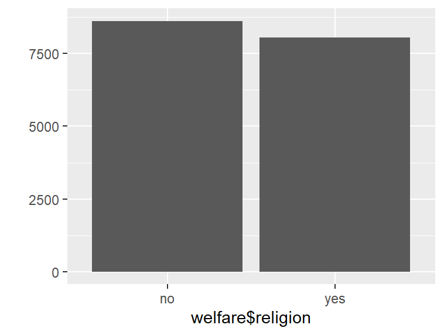
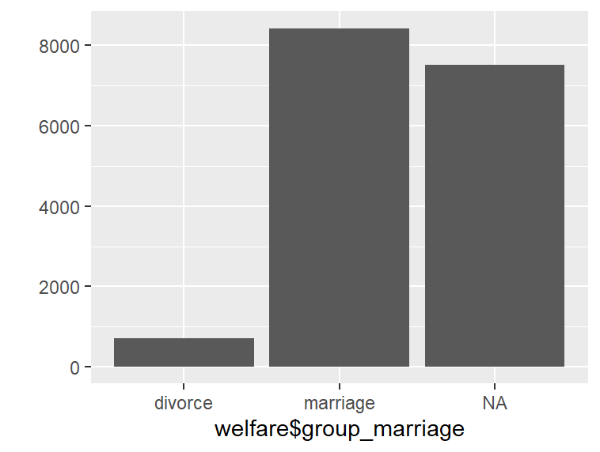
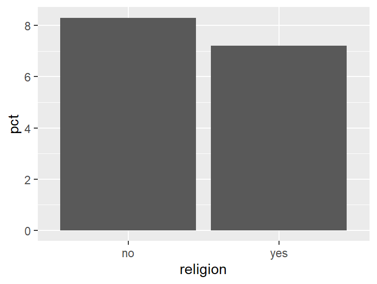
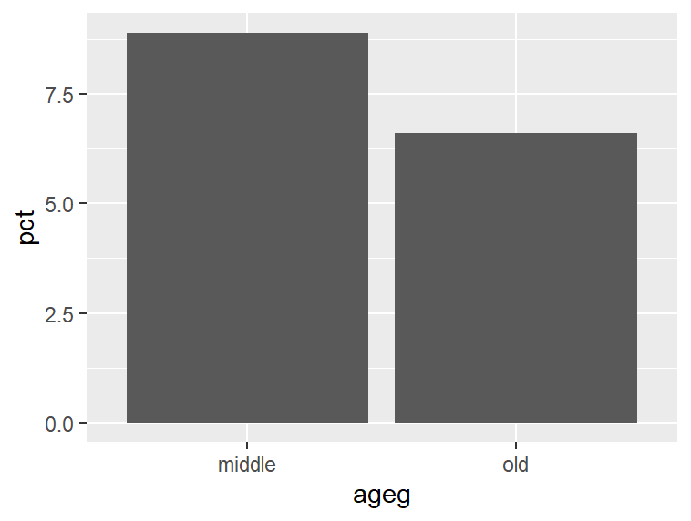
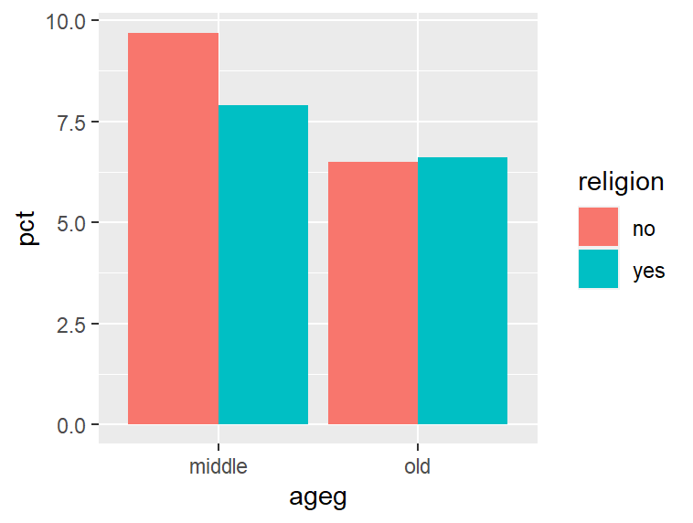
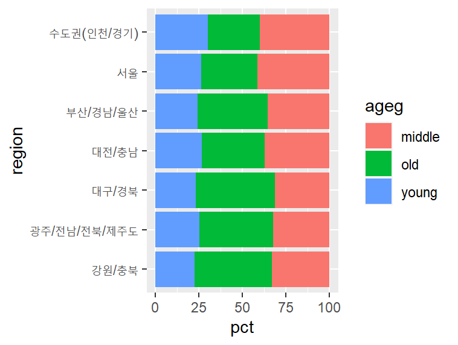
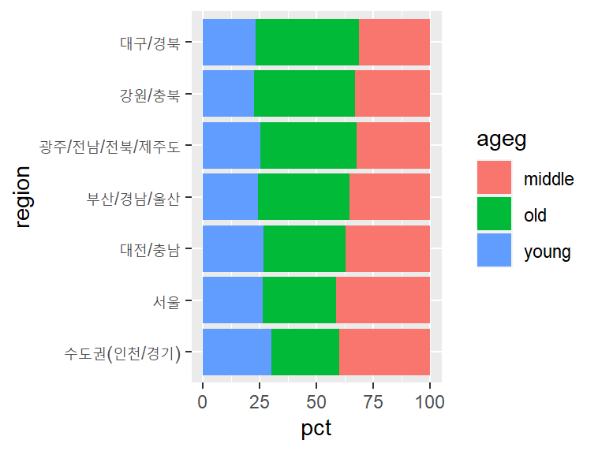

#### 종교 유무에 따른 이혼율
- 종교 변수 검토
```{r}
class(welfare$religion)
# "numeric"
table(welfare$religion)
#    1    2 
# 8047 8617
```

- 전처리, 종교 유무 이름 부여
```{r}
welfare$religion <- ifelse(welfare$religion == 1, "yes", "no")

table(welfare$religion)
#   no  yes 
# 8617 8047 

qplot(welfare$religion)
```


- 혼인 상태 변수 검토
```{r}
class(welfare$marriage)
# "numeric"
table(welfare$marriage)
#    0    1    2    3    4    5    6 
# 2861 8431 2117  712   84 2433   26 
```

- 이혼 여부 변수 만들기
```{r}
welfare$group_marriage <- ifelse(welfare$marriage == 1, "marriage",
                          ifelse(welfare$marriage == 3, "divorce", NA))

table(welfare$group_marriage)
#  divorce marriage 
#      712     8431 

table(is.na(welfare$group_marriage))
# FALSE  TRUE 
#  9143  7521 

qplot(welfare$group_marriage)
```


- 종교 유무에 따른 이혼율 표 만들기
```{r}
religion_marriage <- welfare %>%
  filter(!is.na(group_marriage)) %>%
  group_by(religion, group_marriage) %>%
  summarise(n = n()) %>%
  mutate(tot_group = sum(n),
         pct = round(n/tot_group*100, 1))

religion_marriage
#   A tibble: 4 × 5
#   Groups:   religion [2]
#   religion group_marriage     n tot_group   pct
#   <chr>    <chr>          <int>     <int> <dbl>
# 1 no       divorce          384      4602   8.3
# 2 no       marriage        4218      4602  91.7
# 3 yes      divorce          328      4541   7.2
# 4 yes      marriage        4213      4541  92.8

# count()를 이용해 집단별 빈도를 구하고 비율로 만들기
religion_marriage <- welfare %>%
  filter(!is.na(group_marriage)) %>%
  count(religion, group_marriage) %>% 
  group_by(religion) %>% 
  mutate(pct = round(n/sum(n)*100, 1))
```

- 이혼 추출해 이혼율 표 만들기
```{r}
divorce <- religion_marriage %>%
  filter(group_marriage == "divorce") %>% 
  select(religion, pct)

divorce
#   A tibble: 2 × 2
#   Groups:   religion [2]
#   religion   pct
#   <chr>    <dbl>
# 1 no         8.3
# 2 yes        7.2

ggplot(data = divorce, aes(x = religion, y = pct)) + geom_col()
```


- 연령대, 종교 유무, 결혼 상태별 비율표 만들기
```
ageg_marriage <- welfare %>%
  filter(!is.na(group_marriage)) %>%
  group_by(ageg, group_marriage) %>%
  summarise(n = n()) %>%
  mutate(tot_group = sum(n),
         pct = round(n/tot_group*100, 1))

ageg_marriage
#   A tibble: 6 × 5
#   Groups:   ageg [3]
#   ageg   group_marriage     n tot_group   pct
#   <chr>  <chr>          <int>     <int> <dbl>
# 1 middle divorce          437      4918   8.9
# 2 middle marriage        4481      4918  91.1
# 3 old    divorce          273      4165   6.6
# 4 old    marriage        3892      4165  93.4
# 5 young  divorce            2        60   3.3
# 6 young  marriage          58        60  96.7

# count()를 이용해 집단별 빈도를 구하고 비율로 만들기
ageg_marriage <- welfare %>%
  filter(!is.na(group_marriage)) %>%
  count(ageg, group_marriage) %>% 
  group_by(ageg) %>% 
  mutate(pct = round(n/sum(n)*100, 1))
```

- 연령대별 이혼율 그래프 만들기
```{r}
ageg_divorce <- ageg_marriage %>% 
  filter(ageg != "young" & group_marriage == "divorce") %>% 
  select(ageg, pct)

ageg_divorce
#   A tibble: 2 × 2
#   Groups:   ageg [2]
#   ageg     pct
#   <chr>  <dbl>
# 1 middle   8.9
# 2 old      6.6

ggplot(data = ageg_divorce, aes(x = ageg, y = pct)) + geom_col()
```



- 연령대, 종교유무, 결혼상태별 비율표 만들기
```{r}
ageg_religion_marriage <- welfare %>%
  filter(!is.na(group_marriage) & ageg != "young") %>%
  group_by(ageg, religion, group_marriage) %>%
  summarise(n = n()) %>%
  mutate(tot_group = sum(n),
         pct = round(n/tot_group*100, 1))

ageg_religion_marriage
#   A tibble: 8 × 6
#   Groups:   ageg, religion [4]
#   ageg   religion group_marriage     n tot_group   pct
#   <chr>  <chr>    <chr>          <int>     <int> <dbl>
# 1 middle no       divorce          260      2681   9.7
# 2 middle no       marriage        2421      2681  90.3
# 3 middle yes      divorce          177      2237   7.9
# 4 middle yes      marriage        2060      2237  92.1
# 5 old    no       divorce          123      1884   6.5
# 6 old    no       marriage        1761      1884  93.5
# 7 old    yes      divorce          150      2281   6.6
# 8 old    yes      marriage        2131      2281  93.4

# count()를 이용해 집단별 빈도를 구하고 비율로 만들기
ageg_religion_marriage <- welfare %>%
  filter(!is.na(group_marriage) & ageg != "young") %>%
  count(ageg, religion, group_marriage) %>%
  group_by(ageg, religion) %>% 
  mutate(pct = round(n/sum(n)*100, 1))
```


- 연령대 및 종교 유무별 이혼율 표 만들기
```
df_divorce <- ageg_religion_marriage %>%
  filter(group_marriage == "divorce") %>% 
  select(ageg, religion, pct)

df_divorce
#   A tibble: 4 × 3
#   Groups:   ageg, religion [4]
#   ageg   religion   pct
#   <chr>  <chr>    <dbl>
# 1 middle no         9.7
# 2 middle yes        7.9
# 3 old    no         6.5
# 4 old    yes        6.6

ggplot(data = df_divorce, aes(x = ageg, y = pct, fill = religion )) +
  geom_col(position = "dodge")
```


#### 지역별 연령대 비율
- 지역 변수 검토
```{r}
class(welfare$code_region)
# "numeric"
table(welfare$code_region)
#    1    2    3    4    5    6    7 
# 2486 3711 2785 2036 1467 1257 2922
```

- 지역 변수 전처리
  - 지역 코드 목록 만들기
  ```
  list_region <- data.frame(code_region = c(1:7),
                            region = c("서울",
                                       "수도권(인천/경기)",
                                       "부산/경남/울산",
                                       "대구/경북",
                                       "대전/충남",
                                       "강원/충북",
                                       "광주/전남/전북/제주도"))
  list_region
  #   code_region                region
  # 1           1                  서울
  # 2           2     수도권(인천/경기)
  # 3           3        부산/경남/울산
  # 4           4             대구/경북
  # 5           5             대전/충남
  # 6           6             강원/충북
  # 7           7 광주/전남/전북/제주도
  ```
  
  -  지역명 변수 추가 
  ```
  welfare <- left_join(welfare, list_region, id = "code_region")
  
  welfare %>%
    select(code_region, region) %>%
    head
  #   code_region region
  # 1           1   서울
  # 2           1   서울
  # 3           1   서울
  # 4           1   서울
  # 5           1   서울
  # 6           1   서울
  ```

- 지역별 연령대 비율 분석하기
```
region_ageg <- welfare %>%
  group_by(region, ageg) %>%
  summarise(n = n()) %>%
  mutate(tot_group = sum(n),
         pct = round(n/tot_group*100, 2))

head(region_ageg)
# A tibble: 6 × 5
# Groups:   region [2]
  region                ageg       n tot_group   pct
  <chr>                 <chr>  <int>     <int> <dbl>
1 강원/충북             middle   417      1257  33.2
2 강원/충북             old      555      1257  44.2
3 강원/충북             young    285      1257  22.7
4 광주/전남/전북/제주도 middle   947      2922  32.4
5 광주/전남/전북/제주도 old     1233      2922  42.2
6 광주/전남/전북/제주도 young    742      2922  25.4

# count()를 이용해 집단별 빈도를 구하고 비율로 만들기
region_ageg <- welfare %>%
  count(region, ageg) %>%
  group_by(region) %>% 
  mutate(pct = round(n/sum(n)*100, 2))
```

- 그래프 만들기
  - 연령대별 비율 그래프
  ```
  ggplot(data = region_ageg, aes(x = region, y = pct, fill = ageg)) +
    geom_col() +
    coord_flip()
  ```
  

  - 노년층 비율 높은 순으로 막대 정렬
  ```{r}
  # 노년층 비율 내림차순 정렬
  list_order_old <- region_ageg %>%
    filter(ageg == "old") %>%
    arrange(pct)

  list_order_old
  #   A tibble: 7 × 4
  #   Groups:   region [7]
  #   region                ageg      n   pct
  #   <chr>                 <fct> <int> <dbl>
  # 1 수도권(인천/경기)     old    1109  29.9
  # 2 서울                  old     805  32.4
  # 3 대전/충남             old     527  35.9
  # 4 부산/경남/울산        old    1124  40.4
  # 5 광주/전남/전북/제주도 old    1233  42.2
  # 6 강원/충북             old     555  44.2
  # 7 대구/경북             old     928  45.6

  # 지역명 순서 변수 만들기
  order <- list_order_old$region
  order
  # [1] "수도권(인천/경기)"     "서울"                 
  # [3] "대전/충남"             "부산/경남/울산"       
  # [5] "광주/전남/전북/제주도" "강원/충북"            
  # [7] "대구/경북"         

  ggplot(data = region_ageg, aes(x = region,  y = pct, fill = ageg)) +
    geom_col() +
    coord_flip() +
    scale_x_discrete(limits = order)
  ```
  

  - 연령대 순으로 막대 색깔 나열하기
  ```{r}
  class(region_ageg$ageg)
  # "factor"
  levels(region_ageg$ageg)
  # [1] "old"    "middle" "young" 

  region_ageg$ageg <- factor(region_ageg$ageg,
                            level = c("old", "middle", "young"))

  ggplot(data = region_ageg, aes(x = region,  y = pct, fill = ageg)) +
    geom_col() +
    coord_flip() +
    scale_x_discrete(limits = order)
  ```
  