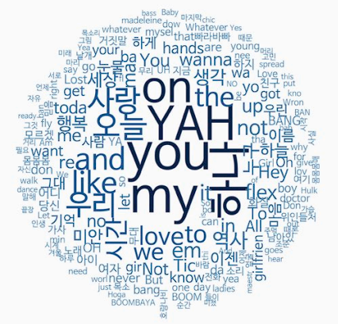

### 텍스트 마이닝
- 문자로 된 데이터에서 가치 있는 정보를 얻어내는 분석 기법
- 형태소 분석 : 문장을 구성하는 어절들이 어떤 품사로 되어있는 지 파악
  - 텍스트 마이닝을 할 때 먼저 하는 작업
  - 명사, 동사, 형용사 등 의미를 지닌 품사의 단어들을 추출해 각 단어가 얼마나 많이 등장했는지 확인

- KoNLP(Korean Natural Language Porcessing) 패키지를 이용해 한글 텍스트의 형태소 분석
  - KoNLP를 사용하기 위해서는 Java와 rJava 패키지가 설치되어야 함
  - install.packages("multilinguer") : 자바 jdk를 이용하기 위한 패키지
    ```r
    library(multilinguer)
    install_jdk()
    ```
  - install.packages(c("stringr", "hash", "tau", "Sejong", "RSQLite", "devtools"), type = "binary") : KoNLP 패키지를 사용하기 위한 의존성 패키지
  - KoNLP 패키지 설치 : install_github를 이용해 설치
    ```r
    install.packages("remotes")
    remotes::install_github(
    "haven-jeon/KoNLP",
    upgrade = "never",
    INSTALL_opts = c("--no-multiarch")
    )
    library(KoNLP)
    ```
    - KoNLP 패키지가 사용하는 NIA 사전 허용
    ```r
    userNIDic()
    )
    ```
- 데이터 준비
```r
txt <- readLines("./Data/hiphop.txt")
head(txt)
# [1] "\"보고 싶다"                  "이렇게 말하니까 더 보고 싶다" "너희 사진을 보고 있어도"     
# [4] "보고 싶다"                    "너무 야속한 시간"             "나는 우리가 밉다"   

# 특수문제 제거
install.packages("stringr")
library(stringr)

txt <- str_replace_all(txt, "\\W", " ")
```

- 가장 많이 사용된 단어 알아보기
```r
# 가사에서 명사추출
nouns <- extractNoun(txt)

# 추출한 명사 list를 문자열 벡터로 변환, 단어별 빈도표 생성
wordcount <- table(unlist(nouns))

# 데이터 프레임으로 변환
df_word <- as.data.frame(wordcount)

# 변수명 수정
df_word <- rename(df_word,
                  word = Var1,
                  freq = Freq)
```

- 자주 사용된 단어 빈도표 만들기
```r
# 두 글자 이상 단어 추출
df_word <- filter(df_word, nchar(word) >= 2)

top_20 <- df_word %>%
  arrange(desc(freq)) %>%
  head(20)

top_20
                       word freq
1                       you   89
2                        my   86
3                       YAH   80
4                        on   76
5                      하나   75
6                      오늘   51
```

### 워드 클라우드
- 단어의 빈도를 구름 모양으로 포현한 그래프
- install.packages("wordcloud") : 워드 클라우드를 만드는 패키지

```r
library(wordcloud)
library(RColorBrewer)

# Dark2 색상 목록에서 8개 색상 추출
pal <- brewer.pal(8, "Dark2")  

set.seed(1234)
wordcloud(
  words = df_word$word,
  # 단어
  freq = df_word$freq,
  # 빈도
  min.freq = 2,
  # 최소 단어 빈도
  max.words = 200,
  # 표현 단어 수
  random.order = F,
  # 고빈도 단어 중앙 배치
  rot.per = .1,
  # 회전 단어 비율
  scale = c(4, 0.3), # 단어 크기 범위
  colors = pal # 색깔 목록
)          
```
