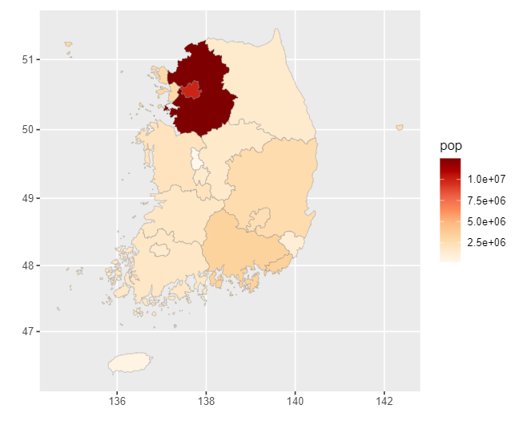
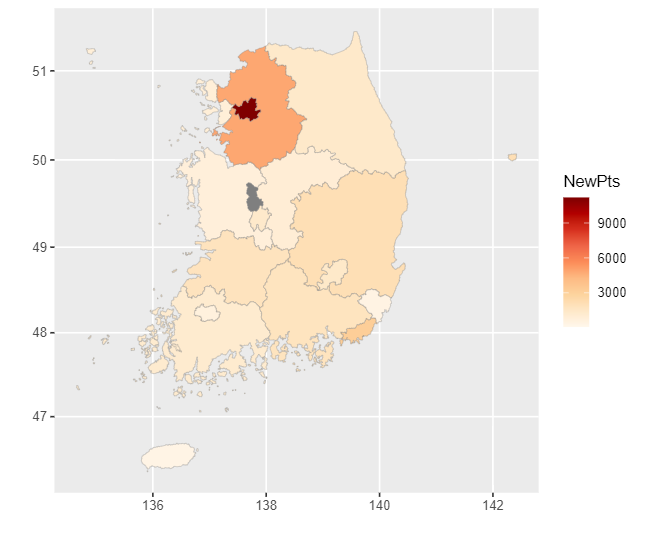

### 미국 지도 시각화
- install.packages("ggiraphExtra") 지도 시각화 패키지
library(ggiraphExtra)
- 단계 구분도 : 지역별 통계치를 색깔의 차이로 표현한 지도

- 미국 주별 범죄 데이터 준비하기
```r
str(USArrests)
# 'data.frame':	50 obs. of  4 variables:
#   $ Murder  : num  13.2 10 8.1 8.8 9 7.9 3.3 5.9 15.4 17.4 ...
# $ Assault : int  236 263 294 190 276 204 110 238 335 211 ...
# $ UrbanPop: int  58 48 80 50 91 78 77 72 80 60 ...
# $ Rape    : num  21.2 44.5 31 19.5 40.6 38.7 11.1 15.8 31.9 25.8 ...

head(USArrests)
# Murder Assault UrbanPop Rape
# Alabama      13.2     236       58 21.2
# Alaska       10.0     263       48 44.5
# Arizona       8.1     294       80 31.0
# Arkansas      8.8     190       50 19.5
# California    9.0     276       91 40.6
# Colorado      7.9     204       78 38.7

# 데이터 프레임 만들기
library(tibble)
crime <- rownames_to_column(USArrests, var = "state")
crime$state <- tolower(crime$state)
str(crime)
# 'data.frame':	50 obs. of  5 variables:
#   $ state   : chr  "alabama" "alaska" "arizona" "arkansas" ...
# $ Murder  : num  13.2 10 8.1 8.8 9 7.9 3.3 5.9 15.4 17.4 ...
# $ Assault : int  236 263 294 190 276 204 110 238 335 211 ...
# $ UrbanPop: int  58 48 80 50 91 78 77 72 80 60 ...
# $ Rape    : num  21.2 44.5 31 19.5 40.6 38.7 11.1 15.8 31.9 25.8 ...
```

- 미국 주 지도 데이터 준비하기
  - install.packages("maps") : 미국 주별 위경도 데이터가 들어있는 패키지
    ```r
    install.packages("maps")
    library(ggplot2)
    states_map <- map_data("state") # 데이터 프레임 형태로 불러오기
    str(states_map)
    # 'data.frame':	15537 obs. of  6 variables:
    # $ long     : num  -87.5 -87.5 -87.5 -87.5 -87.6 ...
    # $ lat      : num  30.4 30.4 30.4 30.3 30.3 ...
    # $ group    : num  1 1 1 1 1 1 1 1 1 1 ...
    # $ order    : int  1 2 3 4 5 6 7 8 9 10 ...
    # $ region   : chr  "alabama" "alabama" "alabama" "alabama" ...
    # $ subregion: chr  NA NA NA NA ...
    ```
- 단계 구분도 만들기
```r
ggChoropleth(data = crime,         # 지도에 표현할 데이터
             aes(fill = Murder,    # 색깔로 표현할 변수
                 map_id = state),  # 지역 기준 변수
             map = states_map,     # 지도 데이터
             interactive = T)      # 인터랙티브
```

### 한국 지도 시각화
- 패키지 준비
  - install.packages("stringi") : 문자 처리 패키지
  - install_github("cardiomoon/kormaps2014") : 지역별 인구통계 데이터가 들어있는 패키지
```r
install.packages("devtools")
devtools::install_github("cardiomoon/kormaps2014")

library(kormaps2014)
str(korpop1)

library(dplyr)
korpop1 <- rename(korpop1,
                  pop = 총인구_명,
                  name = 행정구역별_읍면동)

# 2015년 인구 통계 데이터(시도별)
str(kormap1)

ggChoropleth(data = korpop1,       # 지도에 표현할 데이터
             aes(fill = pop,       # 색깔로 표현할 변수
                 map_id = code,    # 지역 기준 변수
                 tooltip = name),  # 지도 위에 표시할 지역명
             map = kormap1,        # 지도 데이터
             interactive = T)        # 인터랙티브

# 지역 결핵 환자 수에 대한 정보를 담고있는 데이터
str(tbc)

ggChoropleth(data = tbc,           # 지도에 표현할 데이터
             aes(fill = NewPts,    # 색깔로 표현할 변수
                 map_id = code,    # 지역 기준 변수
                 tooltip = name),  # 지도 위에 표시할 지역명
             map = kormap1,        # 지도 데이터
             interactive = T)      # 인터랙티브
```

